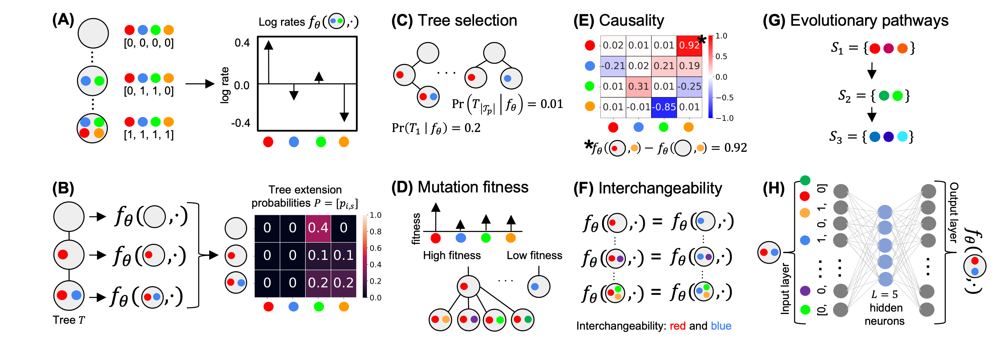

# CloMu: Modeling and Predicting Cancer Clonal Evolution with Reinforcement Learning

CloMu is a neural network based software for cancer phylogeny analysis.

<p align="center">
  
</p>

Dependencies: python3, pytorch, numpy.

## How to use CloMu

[CloMu.py](CloMu.py) contains the CloMu software to be used on any data set. 

[Demo.md](Demo.md) contains a demo for running CloMu. 

[script.py](script.py) is a script which runs and saves results from the CloMu paper. 

[analysis.py](analysis.py) contains the analysis code which was originally used when writing the CloMu paper. 

### Training the Model

To train a model, run the command:
```bash
python CloMu.py train (input format) (input files) (model file) (tree probability file) (mutation name file) (maximum tree length) (optional arguements) 
```
As an example, one can run the below code:
```bash
python CloMu.py train raw ./data/realData/breastCancer.npy ./model.pt ./prob.npy ./mutationNames.npy 9
```
To be specific, "input format" can either be "raw" or "multi". If using raw, "input files" should be the name of the input file with a list of all trees for all patients. "model file" should be the location you want the model to be stored. "tree probability file" should be the location you want to put the predicted probability for each tree in the input data. "mutation name file" should be the name of the file where you want to store the ordered list of mutation names in your data set. "maximum tree length" should be the maximum tree size you want to analyze. Setting it below the length of the longest tree in your data will simply remove patients with a longer tree sizes. "optional arguements" are additional optional inputs you can add. 

One optional arguement is "-noInfiniteSites", to disable the infinite sites assumption. Below is an example of running the code with this.
```bash
python CloMu.py train raw ./data/realData/AML.npy ./temp/model.pt ./temp/prob.npy ./temp/mutationNames.npy 10 -noInfiniteSites
```
Another optional arguement is "-trainSize" followed by an integer number of data points to train on. Below is an example using that feature. 
```bash
python CloMu.py train raw ./data/realData/breastCancer.npy ./model.pt ./prob.npy ./mutationNames.npy 9  -trainSize 200
```
Another optional arguement is "-regularization" which should be followed by a real number (something like 0.01) if one wants to modify the strength of the regularization when training the neural network. Additionally there is "-iter" which should be folloed be an integer number of iterations to train the neural network for. For those developing bioinformatics methods, there is also the "-verbose" which results in more loss information being printed during the training process. 

In addition to the raw input format, we also accept an input format consisting of multiple files. In that case, "input format" should be "multi". Then 'input files" should be (file with a list of trees) (file with the patient number of each tree) (file with the length of each tree). An example is below. 
```bash
python CloMu.py train multi ./data/simulations/I-a/T_4_R_0_bulkTrees.npz ./data/simulations/I-a/T_4_R_0_bulkSample.npz ./data/simulations/I-a/T_4_R_0_treeSizes.npz  ./model.pt ./prob.npy ./mutationNames.npy 10 -trainSize 500
```

### Making Predictions

To predict the probability of a tree, simply include that tree in the data when training the model. The tree probabilities will automatically be evaluated. If you wish to predict the probabilities of trees you do not train on, simply include it the data used by the training function but set the "trainSize" such that that data is not trained on. 

To explicitly make a prediction of one tree per patient given the saved tree probability file, one can run the below command:
```bash
python3 CloMu.py predict selection (tree probability file) (file with patient number for each tree) (file to save predictions)
```
An example of this is given below.
```bash
python3 CloMu.py predict selection ./Models/simulations/I-a/T_4_R_0_baseline.pt.npy ./data/simulations/I-a/T_4_R_0_bulkSample.npz ./treeSelect.npy
```
To predict absolute causality one can run the below command:
```bash
python CloMu.py predict causality absolute (model file) (causality file)
```
An example of this is given below.
```bash
python CloMu.py predict causality absolute ./Models/simulations/I-a/T_4_R_0_model.pt ./causality.npy
```
To interpret the matrix saved in this file, note Matrix[s, t] is the causal relationship from s to t. 
Additionally, for ease of interpretation, one save it as a CSV file with labeled mutations by using the below command:
```bash
python CloMu.py predict causality absolute (model file) (causality file) -csv (mutation name file)
```

To predict relative causality run the below command:
```bash
python CloMu.py predict causality relative (model file) (causality file)
```
This command can also be modified by adding " -csv (mutation name file)" to save as a csv. 
To predict fitness run the below command:
```bash
python CloMu.py predict fitness (model file) (fitness file)
```
Again, add " -csv (mutation name file)" to save as a csv. 
To give latent representations of all mutations run the below command:
```bash
python CloMu.py predict latent (model file) (latent representation file)
```


## The data sets provided: 
In data/simulations/ there are all simulated data sets used in the paper labeled by their name in the paper. In data/realData are the two real data sets used in the paper. For all simulations generated by us (all simulations other than (III) and (IV)), each data set contains twice as many patients as was used in the paper. Only the first half of patients are used for any analysis. The second half of patients (1) allow for other researchers to utilize an exactly identicle set up with more patients if they wish (2) act as a never used test set for researchers interested in using our simulations on a task that requires a seperate test set. These data sets are also in the "multi" format. In contrast, the real data sets are in the "raw" format. 


## Data format:

### general format

The "raw" data format consists of a list of possible trees for each patient, or in order words, a list of lists of trees. Each tree consists of a list of edges. This information is stored in a .npy file. 

The "multi" data format consists of three files. One, a list of all trees with modification that all trees have arbitary edges added (such as [0, 0]) until they reach the same length. Two a list of patient numbers corresponding to each tree. Three, a list of tree lengths for each patient in order to remove the arbitary added edges. Using this format, all input files are tensors (of rank 3 for the trees and 1 for the other two files). The data is stored in compressed .npz files. 

### Without Infinite Sites

With the infinite sites assumption removed, one can not define a tree purely by mutation labels. The same mutation can occur several times in a tree, and thus referencing a parent node only using it's mutation name is ambigous. Therefore, all nodes are labeled by "mutationName_nodeName", using and underscore to seperate them. The mutation name must be a unique name for every mutation at the level of detail that you wish to analyze. For example, for gene level data it would be the gene name. For "nodeName" there must be a unique name for each node in the tree. It is not required to be anything specific such as the number of that node. Currently, only the raw format is accepted when the infinite sites assumption is removed. 


 


